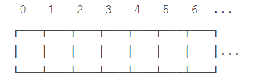
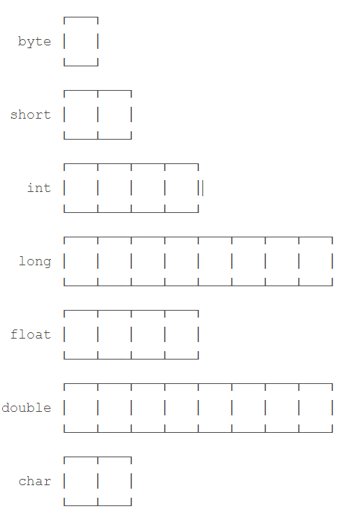
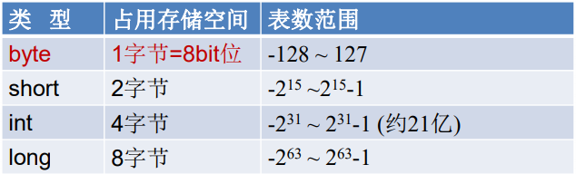
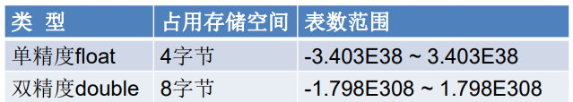
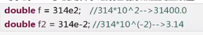
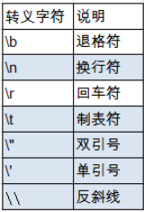

Java是一种强类型的语言，每个变量都必须声明其数据类型。
基本数据类型是CPU可以直接进行运算的类型。Java定义了以下几种**基本数据类型**：
	**整数类型**：byte，short，int，long
	**浮点数类型**：float，double
	**字符类型**：char
	**布尔类型**：boolean

## 计算机内存的基本结构：

​	计算机内存的最小存储单元是字节（byte），一个字节就是一个8位二进制数，即8个bit。它的二进制表示范围从`00000000~11111111`，换算成十进制是`0~255`，换算成十六进制是`00~ff`。
内存单元从0开始编号，称为内存地址。每个内存单元可以看作一间房间，内存地址就是门牌号。

一个字节是1byte，1024字节是1K，1024K是1M，1024M是1G，1024G是1T。一个拥有4T内存的计算机的字节数量就是：
`4T = 4 x 1024G`
	`= 4 x 1024 x 1024M`
	`= 4 x 1024 x 1024 x 1024K`
	`= 4 x 1024 x 1024 x 1024 x 1024`
	`= 4398046511104`

## 不同的数据类型占用的字节数

**byte恰好就是一个字节，而long和double需要8个字节。**

## 基本数据类型默认值

基本数据类型作为类的成员时，

​	即使没有对其进行初始化，

​	java也会确保它有一个默认值，如下：

​	基本类型的初始值 基本类型 默认值

​		`boolean -- false`

​		`char -- \u0000(null)`

​		`byte -- (byte)0`

​		`short -- (short)0`

​		`int -- 0`

​		`long -- 0L`

​		`float -- 0.0f`

​		`double -- 0.0d`

上面的默认值，是当变量作为类的成员使用时才有的，

java这样做是保证基本类型的成员变量得到初始化，

防止产生程序错误，

但这些值在实际的程序中可能都是不合理的

## 整数类型

整数类型: **byte, short, int, long**

Java各整数类型有固定的表数范围和字段长度,不受具体OS的影响,以保证java程序的可移植性。

java的整型常量默认为<u>int型</u>,当用二进制定义整数时，其32位是符号位；

声明long型常量须后加**“l”或“L”**，二进制默认占64位，第64位是符号位

java程序中变量通常声明为int型,除非不足以表示较大的数,才使用long

bit:计算机中的最小存储单位。 byte:计算机中基本存储单元。

**同一个数的不同进制的表示是完全相同的，**

**例如15=0xf＝0b1111。**

**整型常量的四种表示形式：**

- **二进制****(binary):0,1.满二进一，以0b或0B开头**
- **十进制****(decimal):0-9.满十进一**
- **八进制****(octal):0-7.满八进一，以0开头表示**
- **十六进制****(hex):0-9及A-F.满十六进一，以0x或0X开头表示 此处的A-F不区分大小写\*  如:0x21AF + 1 = 0X21B0**

## 浮点类型

float, double表示带小数点的数值

小数点是可以“浮动”的，如1234.5可以表示成12.345x102，也可以表示成1.2345x103，所以称为浮点数。

与整数类型类似, Java浮点类型也有固定的表数范围和字段长度,不受具体操作系统的影响。

浮点型常量有两种表示形式:

- 十进制数形式:如: 5.12	 512.0f 	.512 (必须有小数点)

- 科学计数法形式如: 5.12e2	 512E2 	100E-2

float:单精度,尾数可以精确到7位有效数字。很多情况下,精度很难满足需求。double:双精度,精度是foat的两倍。通常采用此类型。

Java的浮点型常量**默认为double型,声明float型常量,须后加"f或"F.**

## 字符类型

char型数据用来表示通常意义上"字符"(2字节).

Java中的所有字符都使用Unicode编码,故一个字符可以存储一个字母,一个汉字,或其他书面语的一个字符。

字符型变量的三种表现形式:

- 字符常量是用**单引号(' ')括起来的单个字符**。例如: char c1 ='a'; char c2= '中'; char c3='9';

- Java中还允许使用转义字符 '\'来将其后的字符转变为特殊字符型常量

例如: char c3='\n',: // '\n'表示换行符,                                                            

- 直接使用Unicode值来表示字符型常量: '\uXXXX’.其中,XXXX代表一个十六进制整数。如: \u000a表示\n

char类型是可以进行运算的。因为它都对应有Unicode码。

#### 注意：char类型使用单引号'，且仅有一个字符，要和双引号"的字符串类型区分开。

## 布尔类型

布尔型: **boolean**

boolean 类型用来判断逻辑条件，一般用于程序流程控制： 

- if条件控制语句； 
- while循环控制语句； 
- do-while循环控制语句； 
- for循环控制语句； 

boolean类型数据**只允许取值true和false，无null。**

**不可以使用0或非 0 的整数替代false和true，这点和C语言不同。** 

​	Java虚拟机中没有任何供boolean值专用的字节码指令，Java语言表达所操作的 boolean值，在编译之后都使用java虚拟机中的int数据类型来代替：true用1表示，false 用0表示。———《java虚拟机规范 8版》

Java语言对布尔类型的存储并没有做规定，因为理论上存储布尔类型只需要1 bit，但是通常JVM内部会把boolean表示为4字节整数。

