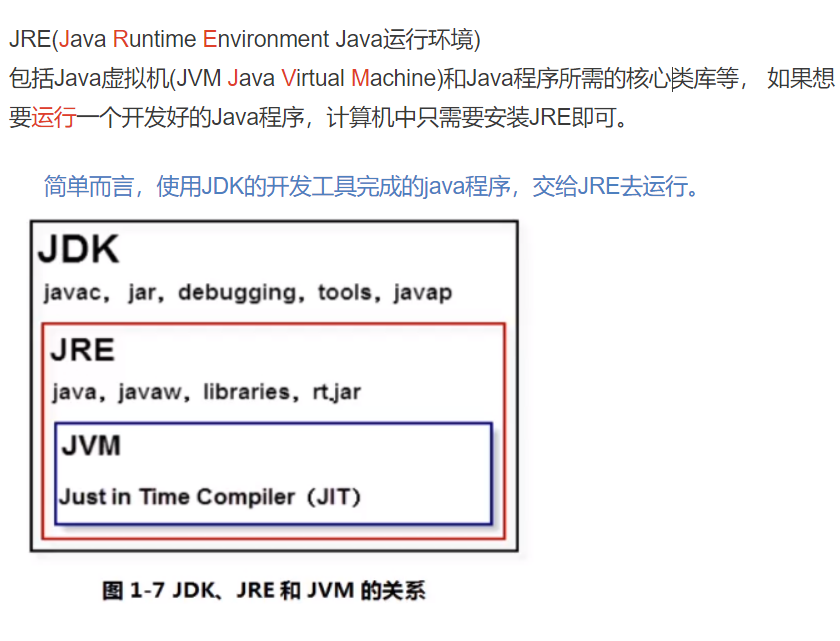

# *<u>**基础知识**</u>*

## Java介绍


## Java简史


## Java体系平台


## Java特点


## Java应用领域


## ***JDK配置:***

#### path环境变量: windows操作系统执行命令时所要搜寻的路径

#### 为什么配置path环境变量?

​	**希望java的开发工具(javac.exe,java.exe)在任何的都可以执行成功.**

### 配置过程 :

(1)新建->变量名"JAVA_HOME"，变量值

```
C:\Java\jdk1.8.0_05（即JDK的安装路径）
```

(2)编辑->变量名"Path"，在原变量值的最后面加上

```
%JAVA_HOME%\bin;%JAVA_HOME%\jre\bin
```

(3)新建->变量名“CLASSPATH”,变量值“

```
.;%JAVA_HOME%\lib;%JAVA_HOME%\lib\dt.jar;%JAVA_HOME%\lib\tools.jar
```

3、确认环境配置是否正确：
在控制台分别输入**java，javac，java -version** 命令，出现如下所示的JDK的编译器信息，包括修改命令的语法和参数选项等信息。

#### 添加jre：

```
bin\jlink.exe --module-path jmods --add-modules java.desktop --output jre
```

## Java两种核心机制


## Java优点


## JDK和JRE





## Java编译过程


## 运行Java程序

Java源码本质上是一个文本文件，我们需要先用javac把Hello.java编译成字节码文件Hello.class，然后，用java命令执行这个字节码文件：


因此，可执行文件javac是编译器，而可执行文件java就是虚拟机。
第一步，在保存Hello.java的目录下执行命令javac Hello.java：

```
$ javac Hello.java
```

如果源代码无误，上述命令不会有任何输出，而当前目录下会产生一个Hello.class文件：

```
$ ls
Hello.class	Hello.java
```

第二步，执行Hello.class，使用命令java Hello：

```
$ java Hello
Hello, world!
```

注意：给虚拟机传递的参数Hello是我们定义的类名，虚拟机自动查找对应的class文件并执行。
直接运行java Hello.java也是可以的：

```
$ java Hello.java
Hello, world!
```

这是Java 11新增的一个功能，它可以直接运行一个单文件源码！
需要注意的是，在实际项目中，单个不依赖第三方库的Java源码是非常罕见的，所以，绝大多数情况下，我们无法直接运行一个Java源码文件，原因是它需要依赖其他的库.

