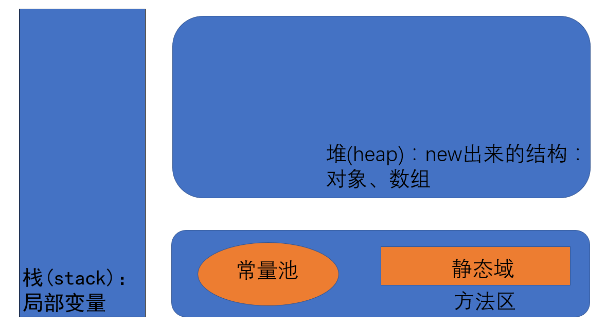
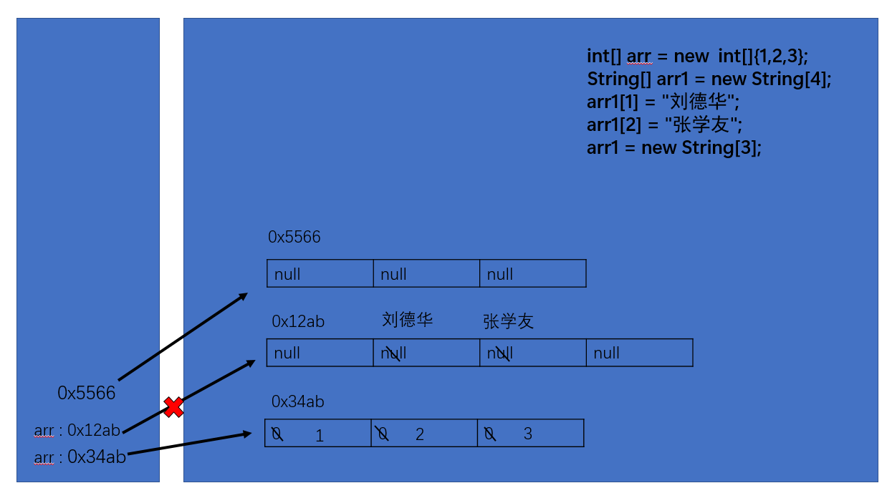

# *<u>**数组**</u>*

### 数组的概述

* 1.**数组(Array)**，是多个相同类型数据按一定顺序排序的集合，并使用一个名字命名

  并通过编号的方式对这些数据进行统一管理

* 2.数组的**概念** :

  * 》数组名
  * 》元素
  * 》角标、索引、下标
  * 》数组的长度：元素的个数

* 3.数组的**特点** :

  * 数组是有序排列的
  * 数组属于引用数据类型的变量，数组的元素 既可以是基本数据类型 也可以是引用数据类型
  * 创建数组对象会在内存中开辟一整块连续的空间
  * 数组的长度一旦确定就不能修改

* 4.数组的**分类** :

  * 按照维数 **一维数组** **二维数组**
  * 按照数组元素的类型 **基本数据类型元素的数组** **引用数据类型元素的数组**

## 一维数组 ---> [Here]()
* 一维数组的使用
  * **一维数组的声明**
  
    ```java
    int[] ids;//声明
    ```
  
  * **静态初始化**:数组的初始化和数组元素的赋值操作同时进行
  
    ```java
    ids = new int[] {1001,1002,1003,1004};
    ```

  * **动态初始化**:数组的初始化和数组元素的赋值操作分开进行
  
    ```java
    String[] names = new String[3];
    ```
  
  * 如何调用数组的指定位置的元素
  
    **数组的角标（索引）从0开始的 到数组的长度-1结束**
  
  * 如何获取数组的长度 属性 length
  
    ```java
    System.out.println(names.length);
    ```
  
  * 如何遍历数组
  
    ```java
    for(int i = 0;i < names.length;i++) {
        System.out.println(names[i]);
    }
    ```
    
  * 数组元素的默认初始化值
  
    ​	数组元素是**整型** **0**
    ​	数组元素是**浮点型** **0.0**
    ​	数组元素是**char** **'0'或 `'\u0000'` 而非0**
    ​	数组元素是**boolean型** **false**
    ​	数组元素是**引用数据类型** :**null**
  
  * 数组的内存解析
  
    
  
    
## 二维数组 ---> [Here]()
规定：二维数组分为外层数组的元素，内层数组的元素

```java
      int[] arr = new int[4][3];
```

- 外层元素 `arr[0] arr[1]`等
- 内层元素 `arr[0][0] arr[1][2]`等


**对于二维数组可以看成一维数组`array1`又作为另一个一维数组`array2`的元素而存在**

* 二维数组的使用
  * 二维数组的声明和初始化
  
    数组元素的默认初始化
        针对初始化方式一 比如 int[][] arr = new int[4][3];
            外层元素的初始化值：地址值
            内层元素的初始化值 与一维数组初始化情况相同
        针对初始化方式二 比如 int[][] arr = new int[4][];
            外层元素的初始化值：null
            内层元素的初始化值 不能调用 否则报错
  
  * 如何调用数组的指定位置的元素
  
  * 如何获取数组的长度
  
  * 如何遍历数组
  
  * 数组元素的默认初始化值
  
  *      数组的内存解析
## Arrays工具类 --->[Here]()


## 常见异常 --->[Here]()


## 练习题 ---> [Here]()
学生成绩最高分
求手机号练习


