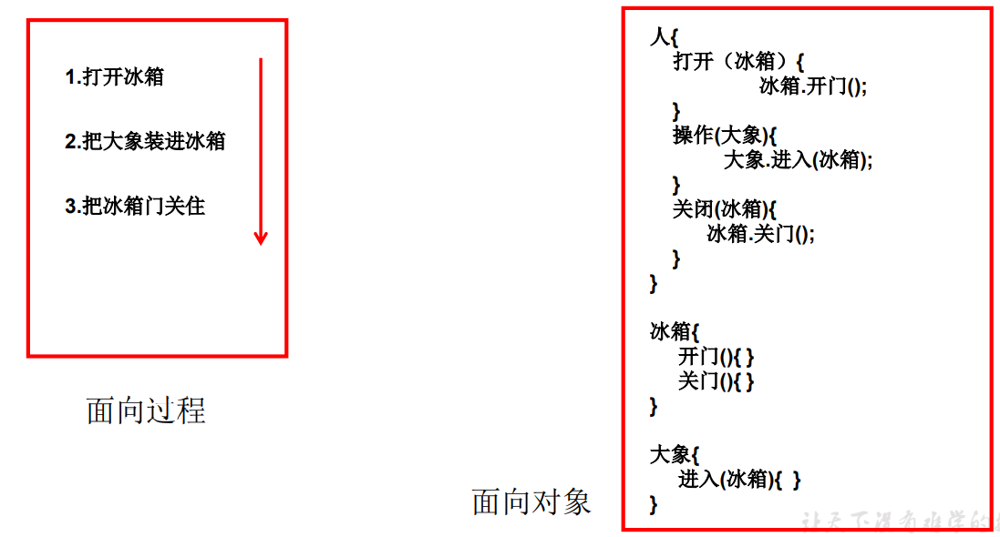

# *<u>**面向对象与面向过程的区别**</u>*

**面向对象：Object Oriented Programming**  

**面向过程：Procedure Oriented Programming**

- ​	二者都是一种思想，面向对象是相对于面向过程而言的。面向过程，**强调的是功能行为，以函数为最小单位，考虑怎么做。**面向对象，将功能封装进对象，**强调具备了功能的对象，以类/对象为最小单位，考虑谁来做。** 

- ​	面向对象更加强调运用人类在日常的思维逻辑中采用的思想方法与原则，如 抽象、分类、继承、聚合、多态等。

